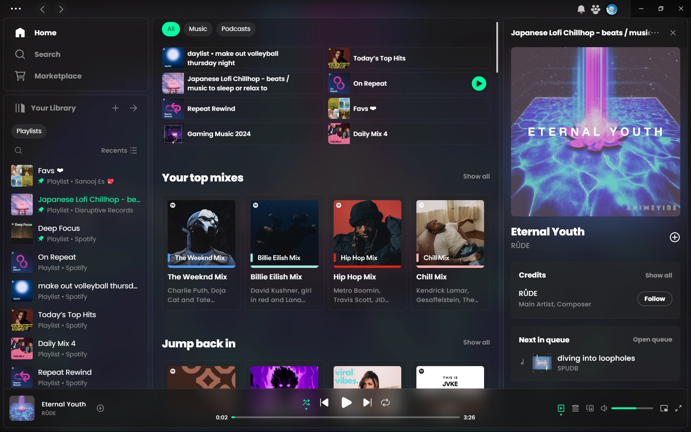

<div align="center">
  <h1>Spiceity Lucid</h1>
  Spicetify theme inspired by Bloom and Microsoft Fluent Design

  <hr>

**Consider starring us !**

## Join the Community!

- **Discord:** [https://discord.gg/knXP88Zbph](https://discord.gg/knXP88Zbph)
- **GitHub Issues:** [https://github.com/sanoojes/Spicetify-Lucid/issues](https://github.com/sanoojes/Spicetify-Lucid/issues)

</div>

## Screenshots

### Dark (default)




### Light


### Comfy


### Darkgreen


### Violet


### Dark-Fluent


### Dark-Bloom


### Midnight-Catppuccin


## Dependencies

- Latest version of [Spicetify](https://github.com/spicetify/spicetify-cli).
- Latest version of [Spotify](https://www.spotify.com/download).
- [Poppins](https://fonts.google.com/specimen/Poppins) font family, from Google Fonts.

## Troubleshooting

### Issues when installing from Spicetify Marketplace

```sh
spicetify config current_theme marketplace color_scheme marketplace
spicetify config inject_css 1 replace_colors 1 overwrite_assets 1 inject_theme_js 1
spicetify apply
```

### There isn't any blur at all

Open Spotify settings and turn on `Enable hardware acceleration`.

### Some custom app on the left navbar has a wrong icon

Please report about that via the repository's issues page.

## License

[MIT License](LICENSE)
