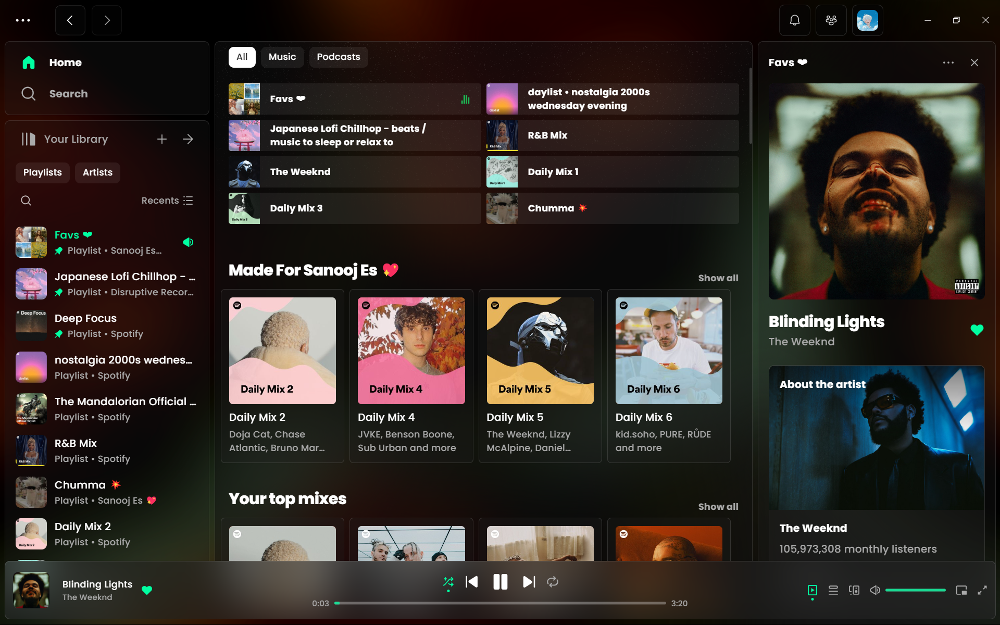
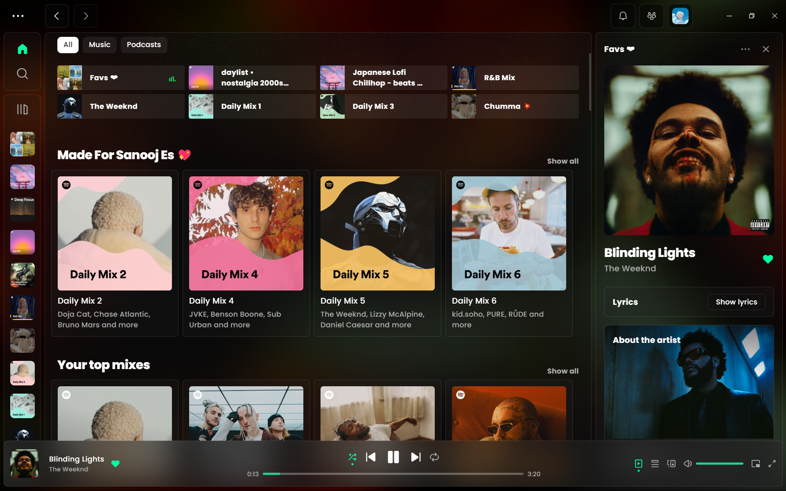
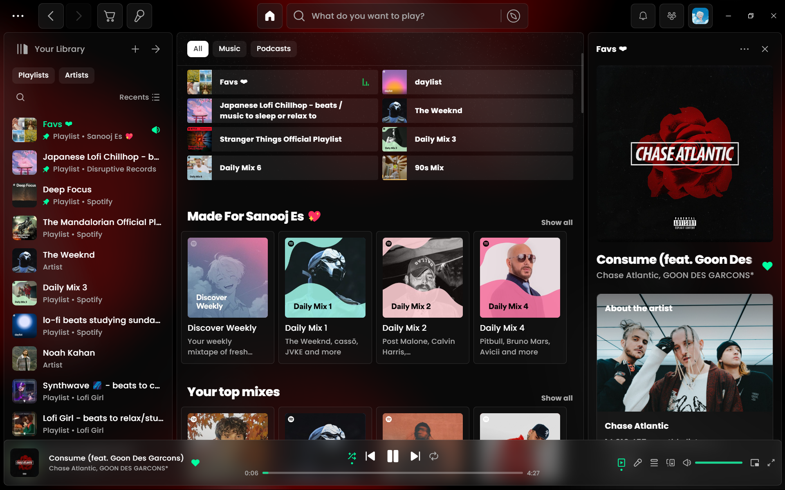
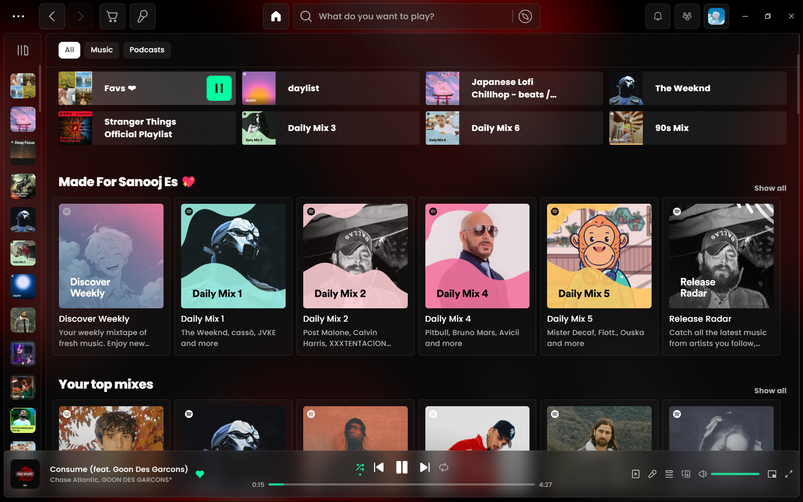
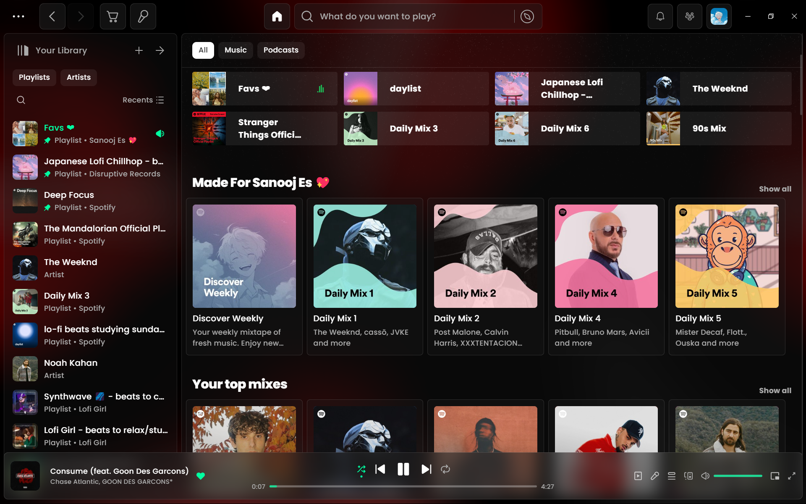
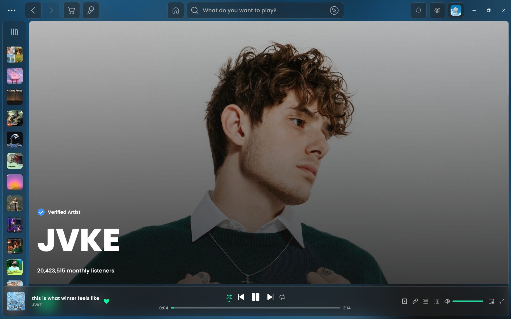
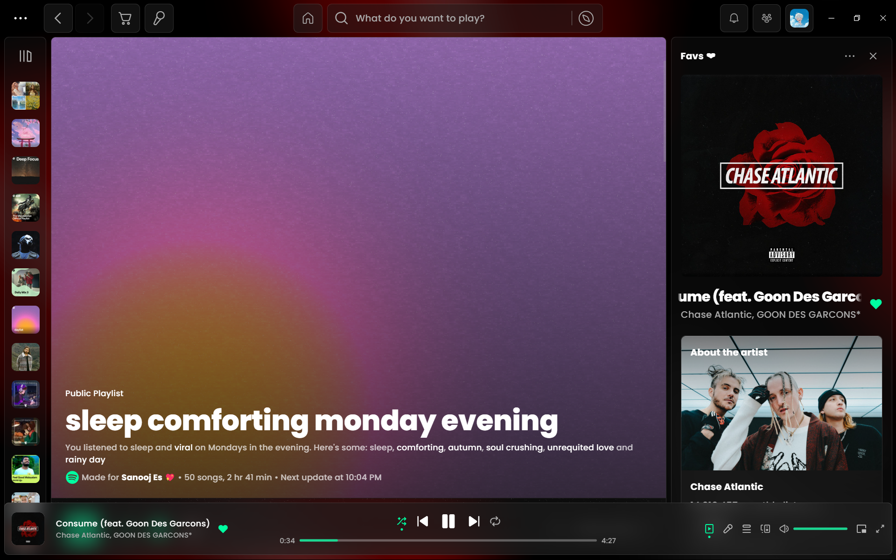
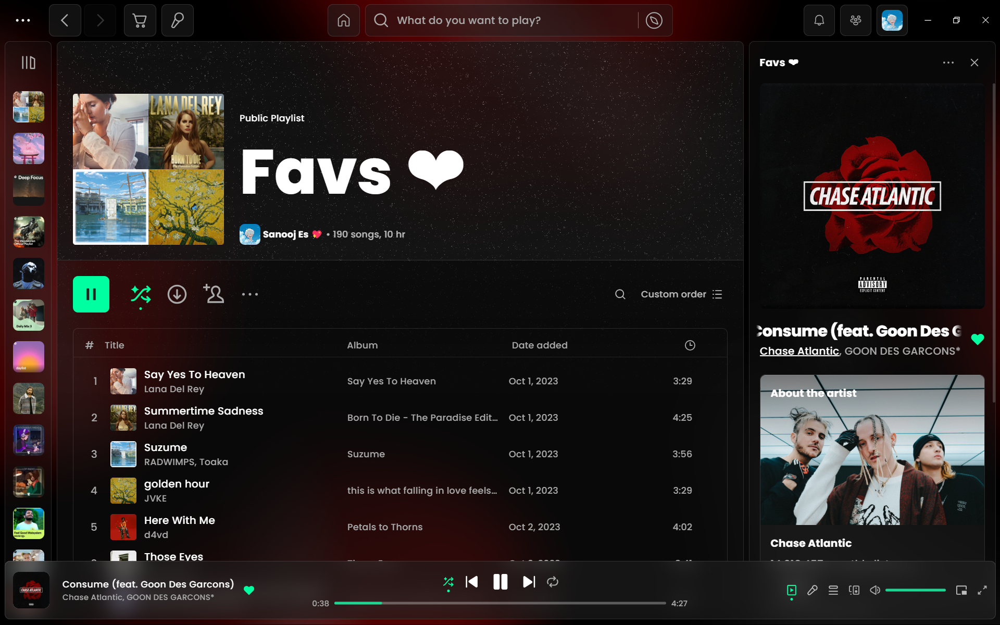

<div align="center">
  <h1>Spiceity Lucid</h1>
  Spicetify theme inspired by Bloom and Microsoft Fluent Design

  <hr>

**Consider starring us !**

## Join the Community!

- **Discord:** [https://discord.gg/knXP88Zbph](https://discord.gg/knXP88Zbph)
- **GitHub Issues:** [https://github.com/sanoojes/Spicetify-Lucid/issues](https://github.com/sanoojes/Spicetify-Lucid/issues)

</div>

## Screenshots

### **Dark (default) with Control Nav**




### **Dark (default)**









## **Customization**

### **Color scheme:**

Available schemes: `dark`, `light`, `darkgreen`, `coffee`, `comfy`, `violet`, `dark-fluent`, `dark-bloom`,`midnight-catppuccin`,`greenland`,`biscuit`,`macos`, `rosepine`,`dracula`.

## Lucid Settings

This section contains available settings for customizing the Lucid theme. Settings are grouped into sections for easier navigation.

### Background Settings

These settings control the overall appearance of the visualizer's background.

| Setting           | Options                                                             | Default            | Description                                                                                                                                                                                                                                                              |
| ----------------- | ------------------------------------------------------------------- | ------------------ | ------------------------------------------------------------------------------------------------------------------------------------------------------------------------------------------------------------------------------------------------------------------------ |
| Background        | - Default Background<br>- Animated Background<br>- Solid Background | Default Background | Selects the type of background to display: <br> - **Default Background:** Displays the default background image. <br> - **Animated Background:** Displays an animated background that responds to audio. <br> - **Solid Background:** Displays a solid color background. |
| Background Grains | - Stary Grains (default)<br>- Normal Grains<br>- No Grains          | Stary Grains       | Chooses the type of grain effect applied to the background: <br> - **Stary Grains:** Displays a subtle, sparkling grain effect. <br> - **Normal Grains:** Displays a standard film grain effect. <br> - **No Grains:** Disables the grain effect.                        |

### Default Background Settings

These settings control the appearance of the default background when no audio is playing and the "Default Background" option is selected in **Background Settings**.

| Setting    | Min | Max | Default | Description                                                                                                                                                              |
| ---------- | --- | --- | ------- | ------------------------------------------------------------------------------------------------------------------------------------------------------------------------ |
| Blur       | 0   | 100 | 24      | Amount of blur applied to the background. Higher values mean more blur.                                                                                                  |
| Brightness | 0   | 200 | 65      | Brightness level of the background. 100 is the default brightness, values below make it darker and above make it brighter.                                               |
| Contrast   | 0   | 200 | 80      | Contrast level of the background. 100 is the default contrast, values below make it less contrasted and above make it more contrasted.                                   |
| Saturation | 0   | 200 | 90      | Saturation level of the background. 100 is the default saturation, values below make it less saturated (more greyscale) and above make it more saturated (more vibrant). |

### Animated Background Settings

These settings control the appearance and behavior of the animated background when audio is playing and the "Animated Background" option is selected in **Background Settings**.

| Setting        | Min | Max | Default | Description                                                                                                                                                                       |
| -------------- | --- | --- | ------- | --------------------------------------------------------------------------------------------------------------------------------------------------------------------------------- |
| Blur           | 32  | 256 | 64      | Amount of blur applied to the animated background. Higher values mean more blur.                                                                                                  |
| Saturation     | 0   | 500 | 150     | Saturation level of the animated background. 100 is the default saturation, values below make it less saturated (more greyscale) and above make it more saturated (more vibrant). |
| Contrast       | 0   | 200 | 115     | Contrast level of the animated background. 100 is the default contrast, values below make it less contrasted and above make it more contrasted.                                   |
| Brightness     | 0   | 200 | 65      | Brightness level of the animated background. 100 is the default brightness, values below make it darker and above make it brighter.                                               |
| Animation Time | 0   | 120 | 45      | Duration in seconds for one animation cycle (0 = no animation, recommended: 30-60).                                                                                               |

### Now Playing Bar Settings

These settings control the appearance of the "Now Playing" bar.

| Setting                  | Min | Max | Default | Description                                                                                                                                                       |
| ------------------------ | --- | --- | ------- | ----------------------------------------------------------------------------------------------------------------------------------------------------------------- |
| Opacity                  | 0   | 100 | 100     | Overall opacity of the bar. 0 is completely transparent, 100 is fully opaque.                                                                                     |
| Background Color Opacity | 0   | 100 | 50      | Opacity specifically for the bar's background color. 0 is completely transparent, 100 is fully opaque.                                                            |
| Height                   | 0   | 500 | 80      | Height of the bar.                                                                                                                                                |
| Padding in X axis        | 0   | 50  | 4       | Horizontal padding within the bar. Higher values mean more space between the content and the edges of the bar.                                                    |
| Margin Bottom            | 0   | 50  | 8       | Spacing between the bottom of the bar and content below it. Higher values mean more space.                                                                        |
| Border Radius            | 0   | 100 | 8       | Rounding of the bar's corners. Higher values mean more rounded corners.                                                                                           |
| Blur                     | 0   | 100 | 32      | Blur applied to the bar. Higher values mean more blur.                                                                                                            |
| Saturation               | 0   | 200 | 100     | Saturation level of the bar. 100 is the default saturation, values below make it less saturated (more greyscale) and above make it more saturated (more vibrant). |
| Contrast                 | 0   | 200 | 100     | Contrast level of the bar. 100 is the default contrast, values below make it less contrasted and above make it more contrasted.                                   |
| Brightness               | 0   | 200 | 100     | Brightness level of the bar. 100 is the default brightness, values below make it darker and above make it brighter.                                               |

## Dependencies

- Latest version of [Spicetify](https://github.com/spicetify/spicetify-cli).
- Latest version of [Spotify](https://www.spotify.com/download).
- [Poppins](https://fonts.google.com/specimen/Poppins) font family, from Google Fonts.

## Troubleshooting

### Issues when installing from Spicetify Marketplace

```sh
spicetify config current_theme marketplace color_scheme marketplace
spicetify config inject_css 1 replace_colors 1 overwrite_assets 1 inject_theme_js 1
spicetify apply
```

### There isn't any blur at all

Open Spotify settings and turn on `Enable hardware acceleration`.

### Some custom app on the left navbar has a wrong icon

Please report about that via the repository's issues page.

## License

[MIT License](LICENSE)
